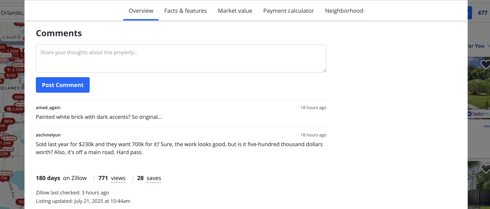

# Zillow with Comments

Ever wonder what Zillow might look like with comments? It seems a [lot of people have](https://x.com/hankgreen/status/1479509887373643780?lang=en), so this is a little proof of concept for how that might work!

This repo consists of two parts:

- The `extension` folder, which houses a Chrome extension to inject a comment box on Zillow listing pages
- The `api` folder, which holds a very basic Laravel API to manage user authentication and comment storage

If you would like to run this project locally, follow these steps after cloning this repo:

1. Install an unpacked extension in Chrome ([guide here](https://developer.chrome.com/docs/extensions/get-started/tutorial/hello-world#load-unpacked)) and point it at the extension folder of this project
2. In a terminal, navigate to the api directory of this project and run `composer install && php artisan migrate`
3. In that same terminal, run `php artisan serve` which should bring up a local webserver at port :8000
4. Finally, navigate to any Zillow listing in your Chrome browser, and you should see a comment box appear after a few seconds under the description of the property

> [!NOTE]
> I don't intend on deploying this to a public service, I feel like I'd get a cease-and-desist letter faster than I can blink lol

Have fun! :blush: Let me know if you'd like to see any particular deep-dives into how this basic extension works, or any potential features you'd like to see added to it.